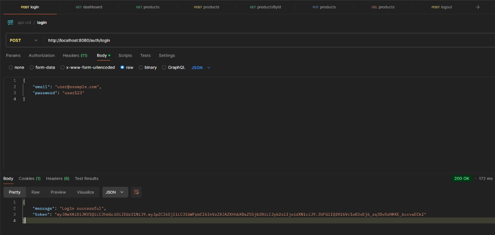
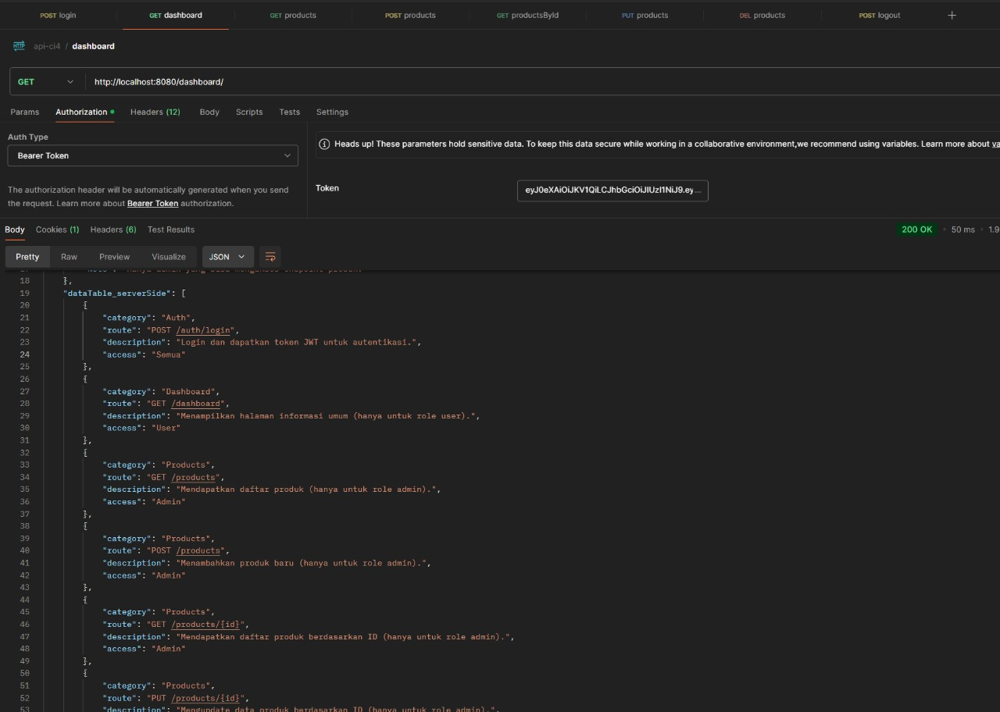
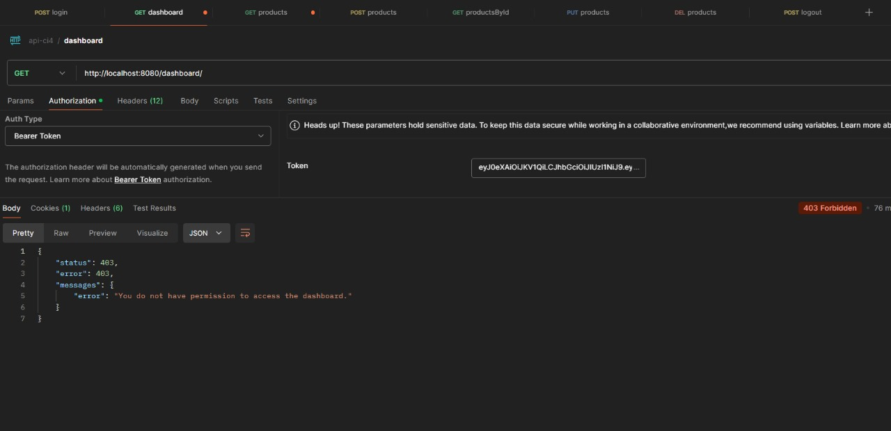
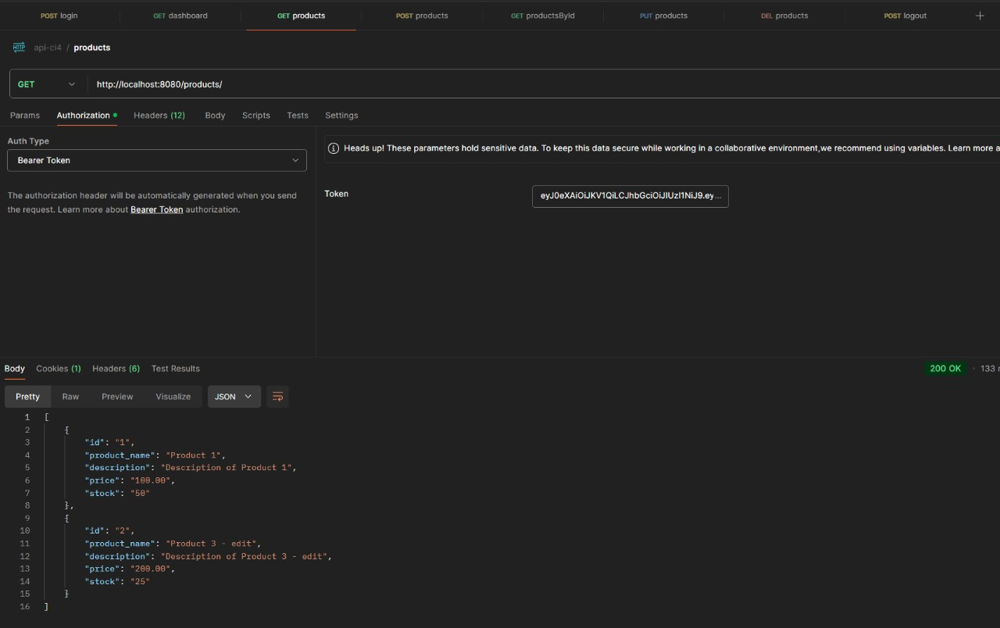
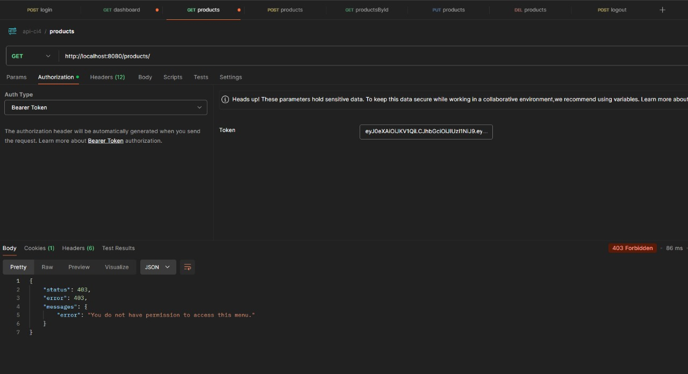
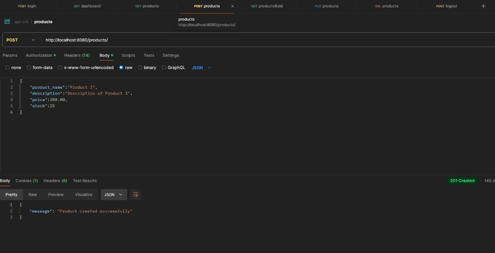
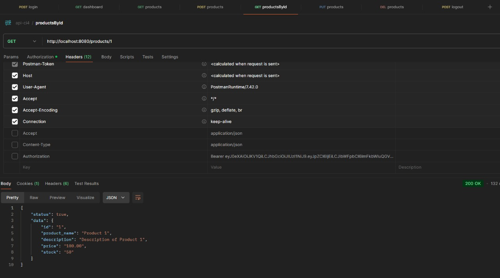
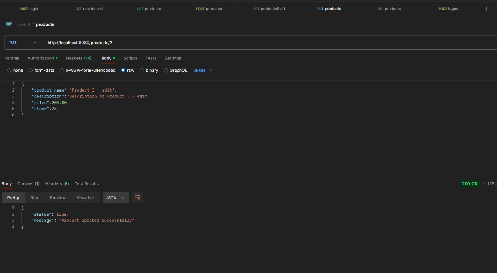

<strong>INSTALL :</strong>

-   Clone Code
-   Open terminal, cd to directory project and run <strong>"composer install"</strong>
-   Create <strong>"Database"</strong> in MySQL
-   Copy <strong>"env"</strong> and rename to <strong>".env"</strong>
-   Edit <strong>"Connection Database"</strong> in <strong>.env</strong>
-   Open terminal, run <strong>"php spark make:migration create_users_table"</strong>
-   Run <strong>"php spark make:migration create_products_table"</strong>
-   Run <strong>"php spark db:seed UserSeeder"</strong>
-   Run <strong>"php spark db:seed ProductSeeder"</strong>
-   Run <strong>"php spark serve"</strong>

<strong>Security</strong>
- JWT Authentication (JSON Web Token): Authorization
- Role Access Control User: Endpoint Filtering
- Validation: Validasi input pada setiap form
- HTTP Header: meminimalisir serangan dari protocol HTTP
- ORM: meminimalisir serangan Query

<strong>Description</strong>
- API ini menyediakan layanan CRUD untuk produk dan manajemen pengguna dengan peran khusus

<strong>Access Roles</strong>
- admin: Hanya dapat mengakses endpoint untuk mengelola produk (CRUD)
- user: Hanya dapat mengakses halaman dashboard

<strong>Usage</strong>
- Authorization: Gunakan header \Authorization: Bearer <token>\ untuk autentikasi di semua endpoint
- Note: Hanya admin yang bisa mengakses endpoint produk

<strong>Route</strong>

Auth
-  POST /auth/login => 'Login dan dapatkan token JWT untuk autentikasi

Dashboard
-  GET /dashboard => 'Menampilkan halaman informasi umum (hanya untuk role user)

Products
-   GET /products => 'Mendapatkan daftar produk (hanya untuk role admin)
-   POST /products => 'Menambahkan produk baru (hanya untuk role admin)
-   GET /products/{id} => 'Mendapatkan daftar produk berdasarkan ID (hanya untuk role admin)
-  PUT /products/{id} => 'Mengupdate data produk berdasarkan ID (hanya untuk role admin)
-  DELETE /products/{id} => 'Menghapus produk berdasarkan ID (hanya untuk role admin)

<strong>Response DataTable Server Side ada pada Halaman Dashboard</strong>

## Screen Shoot

# CodeIgniter 4 Application Starter

## What is CodeIgniter?

CodeIgniter is a PHP full-stack web framework that is light, fast, flexible and secure.
More information can be found at the [official site](https://codeigniter.com).

This repository holds a composer-installable app starter.
It has been built from the
[development repository](https://github.com/codeigniter4/CodeIgniter4).

More information about the plans for version 4 can be found in [CodeIgniter 4](https://forum.codeigniter.com/forumdisplay.php?fid=28) on the forums.

You can read the [user guide](https://codeigniter.com/user_guide/)
corresponding to the latest version of the framework.

## Installation & updates

`composer create-project codeigniter4/appstarter` then `composer update` whenever
there is a new release of the framework.

When updating, check the release notes to see if there are any changes you might need to apply
to your `app` folder. The affected files can be copied or merged from
`vendor/codeigniter4/framework/app`.

## Setup

Copy `env` to `.env` and tailor for your app, specifically the baseURL
and any database settings.

## Important Change with index.php

`index.php` is no longer in the root of the project! It has been moved inside the *public* folder,
for better security and separation of components.

This means that you should configure your web server to "point" to your project's *public* folder, and
not to the project root. A better practice would be to configure a virtual host to point there. A poor practice would be to point your web server to the project root and expect to enter *public/...*, as the rest of your logic and the
framework are exposed.

**Please** read the user guide for a better explanation of how CI4 works!

## Repository Management

We use GitHub issues, in our main repository, to track **BUGS** and to track approved **DEVELOPMENT** work packages.
We use our [forum](http://forum.codeigniter.com) to provide SUPPORT and to discuss
FEATURE REQUESTS.

This repository is a "distribution" one, built by our release preparation script.
Problems with it can be raised on our forum, or as issues in the main repository.

## Server Requirements

PHP version 8.1 or higher is required, with the following extensions installed:

- [intl](http://php.net/manual/en/intl.requirements.php)
- [mbstring](http://php.net/manual/en/mbstring.installation.php)

> [!WARNING]
> - The end of life date for PHP 7.4 was November 28, 2022.
> - The end of life date for PHP 8.0 was November 26, 2023.
> - If you are still using PHP 7.4 or 8.0, you should upgrade immediately.
> - The end of life date for PHP 8.1 will be December 31, 2025.

Additionally, make sure that the following extensions are enabled in your PHP:

- json (enabled by default - don't turn it off)
- [mysqlnd](http://php.net/manual/en/mysqlnd.install.php) if you plan to use MySQL
- [libcurl](http://php.net/manual/en/curl.requirements.php) if you plan to use the HTTP\CURLRequest library
